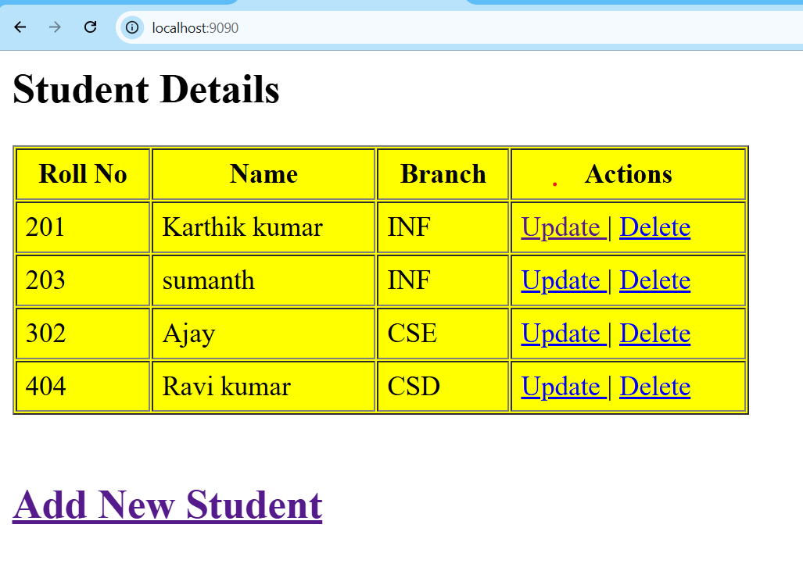

# Student Management System

A simple Student Management System built using Spring Boot, JSP, and MySQL.

## Features

- Add Student
- Update Student
- Delete Student
- View Students

## Technologies Used

- Java
- Spring Boot
- JSP
- MySQL
- HTML
- CSS

## Project Screenshot



## Run the Project

1. Clone the repository

```bash
git clone YOUR_GITHUB_LINK
```

2. Open in STS

3. Configure MySQL

4. Run the application

## Author

Karthik Kumar
